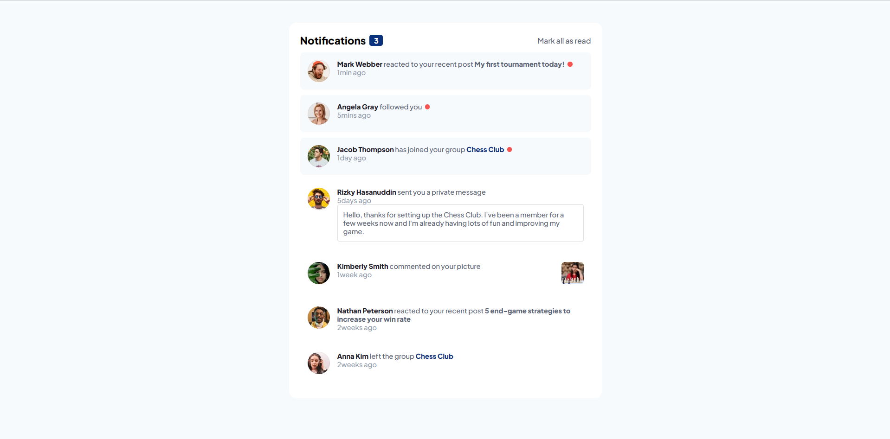
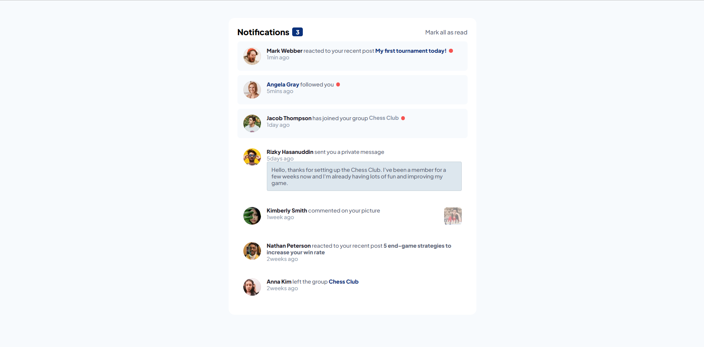
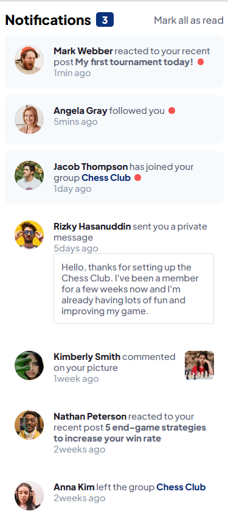

# Frontend Mentor - Notifications page solution

This is a solution to the [Notifications page challenge on Frontend Mentor](https://www.frontendmentor.io/challenges/notifications-page-DqK5QAmKbC). Frontend Mentor challenges help you improve your coding skills by building realistic projects. 

## Table of contents

- [Overview](#overview)
  - [The challenge](#the-challenge)
  - [Screenshot](#screenshot)
  - [Links](#links)
- [My process](#my-process)
  - [Built with](#built-with)
  - [What I learned](#what-i-learned)
  - [Continued development](#continued-development)
- [Author](#author)

## Overview

### The challenge

Users should be able to:

- Distinguish between "unread" and "read" notifications
- Select "Mark all as read" to toggle the visual state of the unread notifications and set the number of unread messages to zero
- View the optimal layout for the interface depending on their device's screen size
- See hover and focus states for all interactive elements on the page

### Screenshot

### Links

- Solution URL: [https://github.com/MoggStephen/notifications-page-main]
- Live Site URL: [https://moggstephen.github.io/notifications-page-main/]

## My process

### Built with

- Semantic HTML5 markup
- Scss
- Dynamic Javascript
- Flexbox
- Mobile-first workflow
- Json
- Fluid Responsive page

### What I learned

- Used a min and max function to create a fluidly responsive page that sizes from desktop to mobile screen widths keeping centered!

### Continued development

- After working on a project with bootstrap, i see the benefits of it and am going to use it for the rest of my projects. Not writing the majority of the css greatly improves the speed at which you can develop.
- I also need to get some experience with a bundler like parcel in node.js environment and start working on react projects!
- As well i need to start getting used to small librarys like swiper.js so that i have experience with implementing them into a webpage!

## Author

- Frontend Mentor - [@MoggStephen](https://www.frontendmentor.io/profile/MoggStephen)